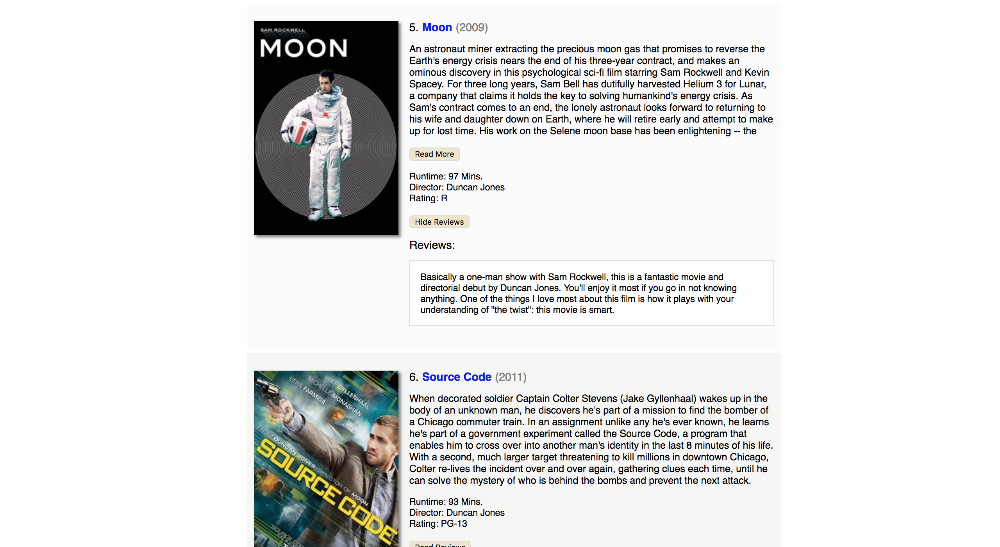

## Movies Database

How to Run:

* Mac:
 1. Install Node (https://nodejs.org/en/download/)
 2. On your terminal, `cd` into the `movies` directory
 2. Initialize node modules by running `npm install` in the terminal
 3. Start the server using `npm run server` in the terminal
 4. Open browser and browse to `http://localhost:8080`

* Windows:
 1. Install Node (https://nodejs.org/en/download/)
 2. On your cmd prompt, `cd` into the `movies` directory
 2. Initialize node modules by running `npm install` in the cmd prompt
 3. Start the server using `npm run server` in the cmd prompt
 4. Open browser and browse to `http://localhost:8080`
